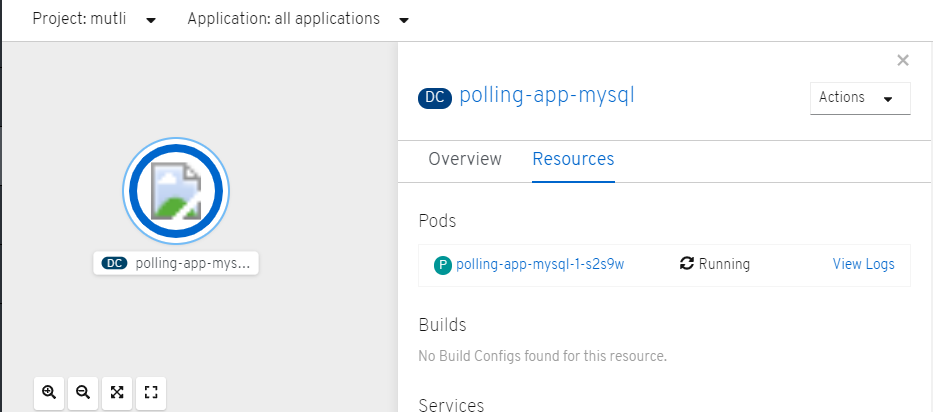
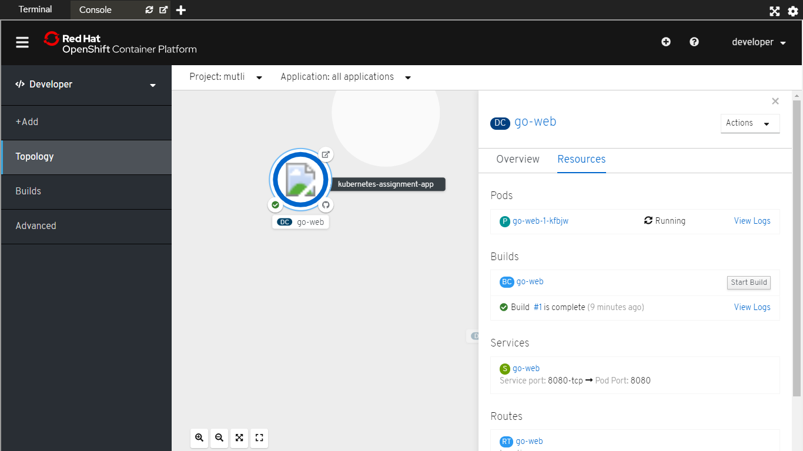
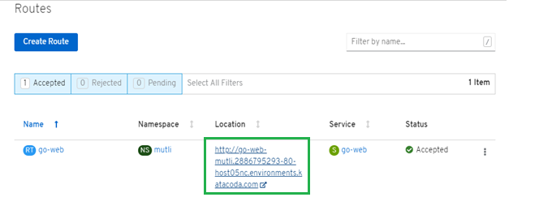
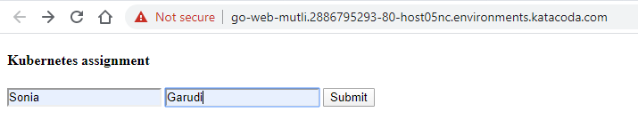
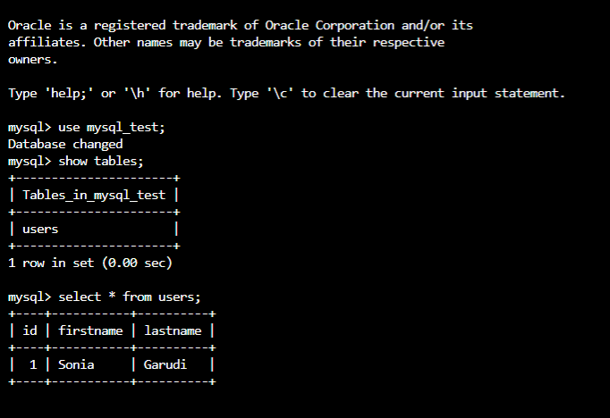

# kubernetes-assignment

This example creates two pods - One deploys a webpage page to take inputs from the user. The other pod had Mysql database running on it.
The input entered by user in webpage is added to the database running in different pod.

Create docker image using the available DockerFile :
`docker build -t go-webapp .`

Commands to create required deployments and services :
```
kubectl.exe apply -f "web-app-go.yaml"
kubectl.exe apply -f "mysql-deployment.yaml"
```

Get the URL for the hosted webpage :
`minikube.exe service web-service --url`


**TO DEPLOY THIS APPLICATION TO OPENSHIFT :**

1. Create database ‘polling-app-mysql’ : **Go to Topology view -> Add -> Database**

    <a>
      
    </a>
    
2. Created deployment ‘go-web’ using Dockerfile at https://github.com/sonia-garudi/kubernetes-assignment : **Go to Topology view -> Add -> Using Dockerfile**

    <a>
      
    </a>
    
3. Use the link mentioned in the route created to access the go-web application in browser : **Go to Administrator view -> Workloads -> Routes** - Click on the location link for the go-web deployment. 

    <a>
      
    </a>

4. You will be redirected to the go-web page. Enter details and click submit. This will add the entries to a table in the database created in step 1

    <a>
      
    </a>

5. Check the database pod. **Go to Administrator view -> Workloads -> Pods -> go-web pod -> Terminal -> Login to MYSQL database**

    <a>
      
    </a>
   
